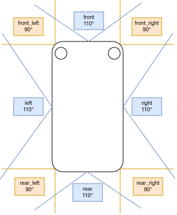

# Vehicle catalogue with different sensor setups

This folder contains a variety of vehicle configurations that can be spawned inside of CARLA. Each vehicle comes with a specific sensor setup that defines different types of sensors as well as individual sensor parameters.
The cars are mostly inspired by autonomous driving datasets or cars that interesting for the autonomous driving research at the IES. We offer the following cars:

- [Argoversev2](./argoversev2_vehicle.json) ([Argoversev2 dataset](https://www.argoverse.org/av2.html))
- [Nuscenes](./nuscenes_vehicle.json) ([Nuscenes dataset](https://www.nuscenes.org/nuscenes))
- [Waymo Open](./waymo_open_vehicle.json) ([Waymo Open dataset](https://waymo.com/open/))
- [IES](./ies_vehicle.json) (Custom autonomous driving car at the research group IES at the university of Kassel)
- [ELV](./argoversev2_vehicle.json) (Car with 8 Lidars for experimentation and object detection experiments)

## Building vehicles blueprint

CARLA comes with a huge variety of [Vehicles](https://carla.readthedocs.io/en/latest/catalogue_vehicles/) and [Sensors](https://carla.readthedocs.io/en/latest/ref_sensors/) that can be used to create your own custom vehicle.

Lets look at the setup of the ELV car. We chose to have 4 sensors on the sides and 4 sensors at the corners of the car depicted by the following image.



Looking at only one of the sensors `front` we can define the car as follows:

```python
"objects": [
    {
        "type": "vehicle.tesla.model3", # model type
        "id": "ego_vehicle", # unique id
        "roll_name": "ego_vehicle", # name during carla life cycle
        "attach": true,
        "sensors": [ # list of attached sensors
            {
                "type": "sensor.lidar.ray_cast_semantic", # sensor type
                "id": "lidar_front", # topic name 
                "spawn_point": {"x": 2.15, "y": 0.0, "z": 0.3, 
                # coordinates in the cars cord-system
                "roll": 0.0, "pitch": 0.0, "yaw": 0.0},
                "range": 100, # range in meters
                "channels": 64,
                "points_per_second": 320000,
                "upper_fov": 22.5,
                "lower_fov": -22.5,
                "rotation_frequency": 20,
                "horizontal_fov": 110.0 
            },
```